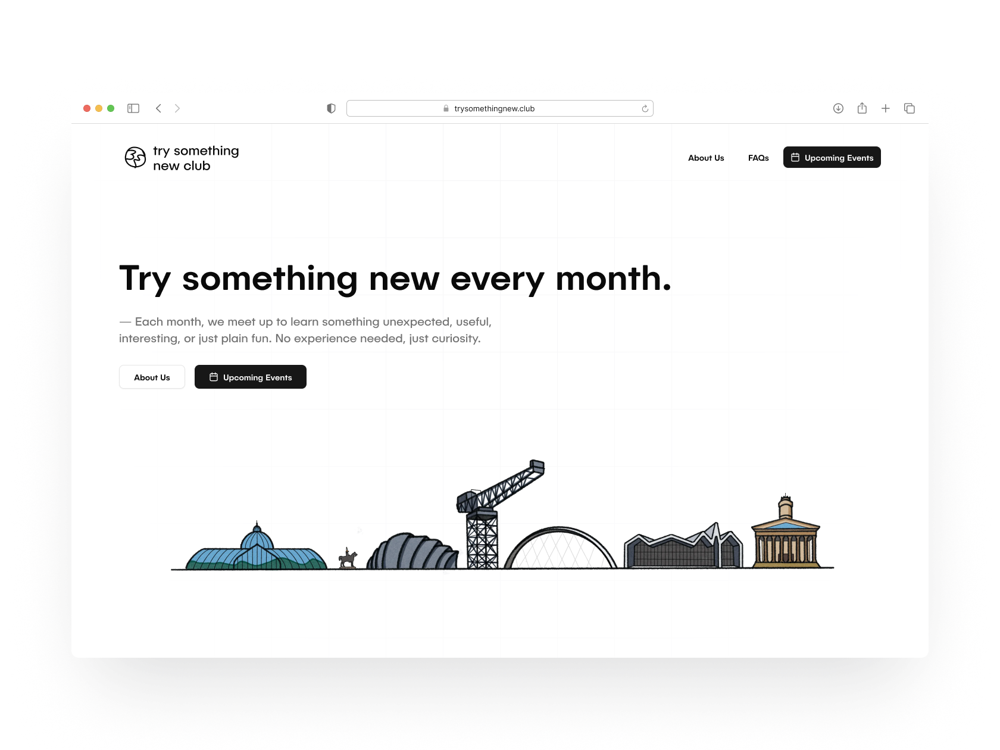

# Try Something New Club

**Try Something New Club** — a monthly meetup in Glasgow where people come together to learn a new skill, discover creative hobbies, and make new friends along the way.

---

## Overview

This project powers the website and community platform for the **Try Something New Club**, an initiative encouraging curiosity and creativity through shared experiences.

Each month, the club hosts a surprise skill workshop — from crafts to coding — giving people a fun way to step outside their comfort zones and meet others doing the same.  
The website acts as both an event hub and a community dashboard for sharing photos, links, and stories.

---

## Features

- 🗓️ **Event Listings & Signups** — explore and RSVP to upcoming sessions  
- 🔐 **Auth with Clerk** — secure sign-in for members and admins  
- ⚡ **Realtime Database with Convex** — live RSVPs and attendance tracking  
- 📰 **Contentful CMS Integration** — easy content management for events and announcements  
- 💬 **Community Dashboard** — members can share updates and photos from past events  
- 🧩 **Turborepo Monorepo Architecture** — shared UI components and clean structure  
- 🎨 **ShadCN UI & TailwindCSS** — accessible, responsive, and cohesive design system  

---

## Tech Stack

- Framework: **Next.js (App Router)**  
- Language: **TypeScript**  
- Styling: **TailwindCSS + ShadCN UI**  
- Authentication: **Clerk**  
- Database: **Convex**  
- CMS: **Contentful**  
- Events: **Lumo**  
- Monorepo: **Turborepo**

---

## Demo

- [Live Website](https://trysomethingnewclub.netlify.app/)  
- [Figma Design](https://www.figma.com/design/PxaBMjSYNsNlMyO2C34i1o/%E2%AD%90%EF%B8%8F-TrySomethingNewClub---Kelsie-Murphy-s-Portfolio)

---

## Getting Started (Local Development)

### Prerequisites

- Node.js (LTS recommended)  
- pnpm (recommended) or npm/yarn  
- Accounts for Clerk, Convex, and Contentful  

---

### 1. Clone the repository

    git clone https://github.com/kelsiesmurphy/trysomethingnew.club.git  
    cd trysomethingnew.club

---

### 2. Install dependencies

    pnpm install  
    # or  
    npm install  
    # or  
    yarn

---

### 3. Configure environment variables

Create a `.env.local` file in the /apps root and include:
    # ---- Configs ----

    NEXT_PUBLIC_SHOW_COMING_SOON=false
    NEXT_PUBLIC_USE_CMS=false

    # ---- Contentful ----

    NEXT_PUBLIC_CONTENTFUL_SPACE_ID=XXXX
    NEXT_PUBLIC_CONTENTFUL_ENVIRONMENT=XXXX
    # Use this access token to consume published content (i.e. content in “Published” status)
    NEXT_PUBLIC_CONTENTFUL_DELIVERY_ACCESS_TOKEN=XXXX
    # Use this access token to preview and consume unpublished content (i.e. content in “Draft” status).
    NEXT_PUBLIC_CONTENTFUL_PREVIEW_ACCESS_TOKEN=XXXX

---

### 4. Run the development server

    pnpm run dev  
    # or  
    npm run dev

Visit [http://localhost:3000](http://localhost:3000) to view it locally.

---

## Scripts

- **dev** — Start development server  
- **build** — Build for production  
- **start** — Run production build  
- **lint** — Check code quality  
- **format** — Format with Prettier  

Example usage:

    pnpm run build  
    pnpm run dev

---

## Project Structure

This is a **Turborepo monorepo**, consisting of:

- `apps/web` — main Next.js web application  
- `packages/ui` — shared ShadCN UI components  
- `packages/eslint-config` — ESLint config files  
- `packages/typescriptco` — Typescript config files

---

## Author

### Kelsie Murphy

- 🌐 [Portfolio](https://kelsiesmurphy.com)  
- 🐙 [GitHub](https://github.com/kelsiesmurphy)  

---

**Try Something New Club** — learn something new, meet someone new.
